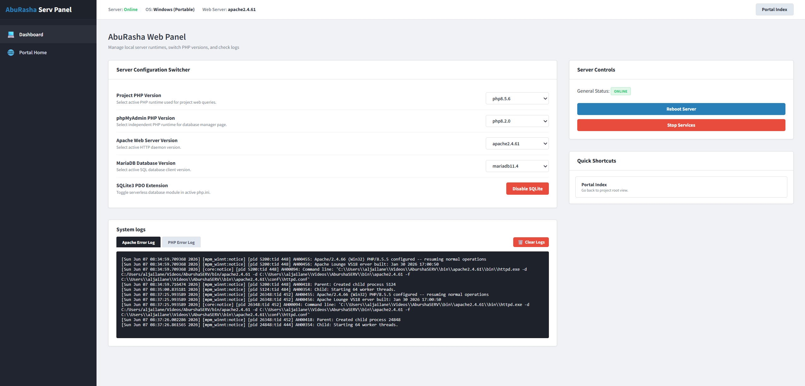
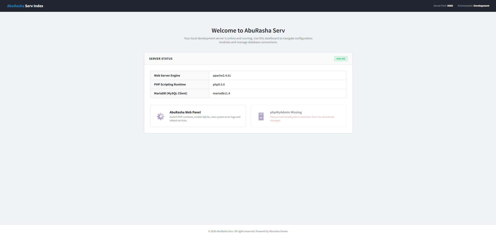
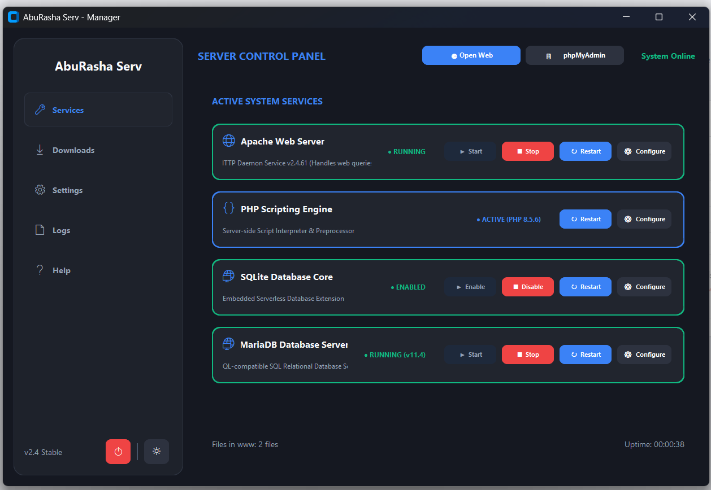
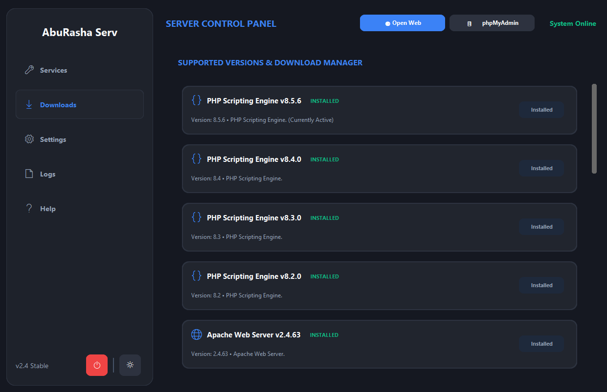
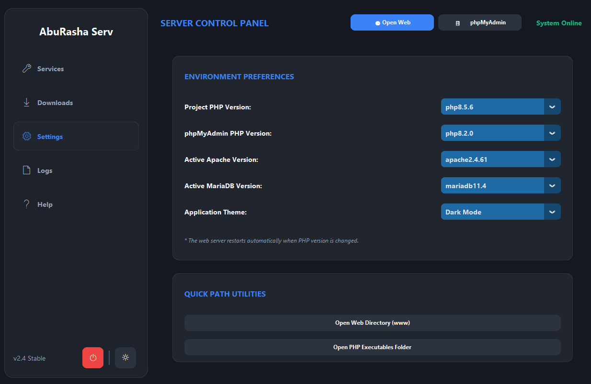
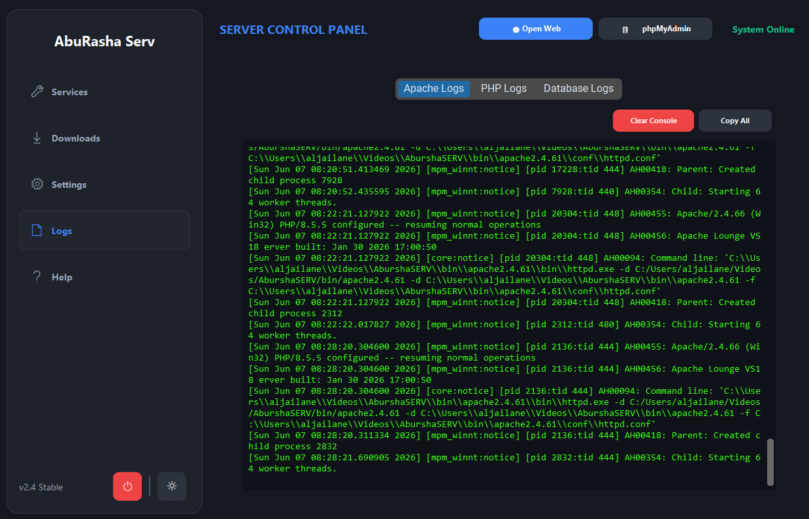

# AbuRasha Web Server

AbuRasha Web Server is a professional, portable local development server environment for Windows. It provides a simple and high-performance alternative to traditional local stacks, featuring a custom GUI Control Panel and a web-based administration panel designed for seamless local development.

## 🚀 Features

- **Portable Stack:** Runs out of the box without installation. Includes pre-configured runtimes for:
  - **Apache Web Server** (multiple versions)
  - **PHP Runtime** (multiple versions)
  - **MariaDB Database** (MySQL compatible)
- **Interactive GUI Manager:** A modern desktop dashboard built using Python and CustomTkinter to start/stop services, download additional components, and monitor system states.
- **AbuRasha Web Panel (`adminserver.php`):** A web-based admin control panel allowing developers to:
  - Switch PHP runtimes for projects on the fly.
  - Set independent PHP versions for phpMyAdmin.
  - Switch Apache and MariaDB daemon versions.
  - Enable/disable the SQLite3 PDO extension with one click.
  - View real-time Apache and PHP logs with terminal-style viewer and clearing utilities.
  - Perform instant service reboots with a smart loading overlay (intercepts connections and reloads automatically once the server is back online).

## 🛠️ Technology Stack

- **Backend Logic:** PHP & Python
- **GUI Desktop App:** Python (CustomTkinter)
- **Web Frontend:** HTML, CSS, JavaScript (Vanilla implementation matching classic web panel styling)

## 📦 Packaged Runtimes & Available Versions

AbuRasha Web Server comes bundled with multiple pre-configured versions of popular web stack runtimes. You can switch between them seamlessly:

- **PHP Runtimes:**
  - `PHP 5.2.1` (Legacy support)
  - `PHP 8.2.0`
  - `PHP 8.3`
  - `PHP 8.4`
  - `PHP 8.5.6` (Latest Active PHP version)
- **Apache Web Server:**
  - `Apache 2.4.59`
  - `Apache 2.4.60`
  - `Apache 2.4.61`
  - `Apache 2.4.62`
  - `Apache 2.4.63` (Latest Active Apache version)
- **MariaDB Database:**
  - `MariaDB 10.11 LTS`
  - `MariaDB 11.4 LTS` (Latest Active MariaDB version)
- **phpMyAdmin:**
  - `phpMyAdmin 5.2.3` (Database Administration)

## 📁 Repository Structure

```text
├── bin/                 # Component runtimes (Apache, PHP, MariaDB)
├── config/              # Configuration templates & active server settings
├── www/                 # Server web root containing index.php & adminserver.php
├── manager.py           # GUI Desktop Control Panel source code
├── AbuRashaServ.exe     # Compiled Windows Desktop executable manager
└── start.bat            # Quick launcher script
```

## ⚙️ How to Use

1. Clone or download the repository into a directory on your Windows PC.
2. Launch `start.bat` or run `AbuRashaServ.exe` to open the Control Panel.
3. Start the services (Apache, MariaDB) from the desktop dashboard.
4. Open `http://localhost:8080` in your web browser to access the Server Index.
5. Click **AbuRasha Web Panel** to configure runtimes or view error logs.

## 📸 Screenshots & Verification

### 🖥️ AbuRasha Web Panel (Web Administration & Settings)
Here is the web control interface (`adminserver.php`) used to manage logs, SQLite, PHP/Apache configurations, and server reboots:

| Web Panel Dashboard | Real-time Logs & SQLite Control |
| :---: | :---: |
|  |  |

---

### 🌐 Local Web Server & Services GUI
The desktop control application interface and local web index dashboard:

| Server Desktop Dashboard | Component Manager (Apache/PHP/DB) |
| :---: | :---: |
|  |  |

| Database Config Portal | Apache/PHP Status & Log Viewers |
| :---: | :---: |
|  |  |

## 📅 Changelog & Updates (Up to June 7, 2026)

### v2.4 Stable (June 7, 2026)
- **Dynamic Reconnection Overlay:** Implemented an AJAX interception system that catches page restarts and displays a gorgeous loading overlay while automatically checking when Apache is back online before reloading the panel.
- **System Logs Cleansing Button:** Added a dynamic, tab-aware "Clear Logs" button inside the log viewer panel to easily empty Apache and PHP logs with backend synchronization.
- **Enhanced Localizations:** Transformed the administration panel help, buttons, and server status elements to be English-friendly, aligning with modern web dashboard layout standards.
- **Upgraded Runtimes:** Packaged stable, portable releases of PHP 8.5.6, Apache 2.4.63, and MariaDB 11.4 as the current default options.
- **Robust SQLite Toggle:** Integrated one-click SQLite3 activation/deactivation inside the php.ini configuration with automatic service reload.

## 📄 License

This project is open-source and available under the MIT License.
